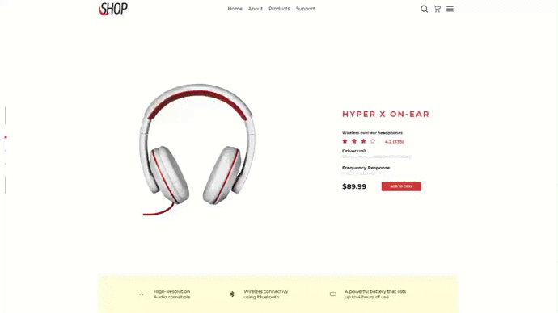

# Shop-devChallenge :rocket:

Repositório responsável por armazenar o resultado do desafio do Dev Challenge do site Shop.

## Dev Challenge :computer:

O Dev Challenge é um site onde é listado uma série de desafios para serem reproduzidos.

## Shop :rocket:

O Shop foi a tela escolhida.

## Tecnologias utilizadas :book:

- React

## Conhecimentos obtidos

- Lidar com responsividade

## Como rodar :fire:

1. Clone este repositório
1. Rode `yarn add`.
1. Rode `yarn start`.
1. Acesse `localhost:3000`.

###### Com amor :heart: Samuel
